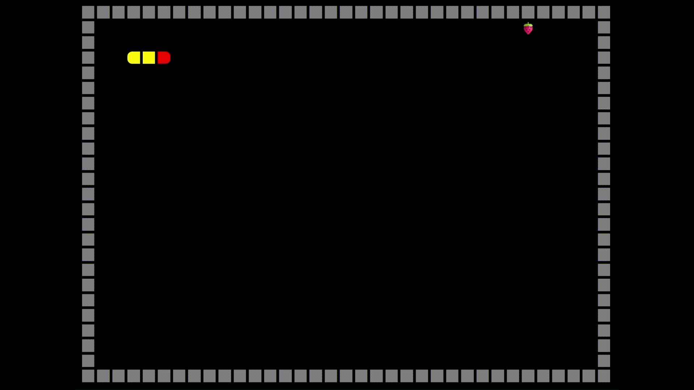

## 🎮 JSGame Jogo da Cobrinha

  

Bem-vindo ao **JSGame Jogo da Cobrinha**! Neste repositório, você encontrará um jogo simples e divertido, inspirado no clássico *Jogo da Cobrinha*.

🎲 **[Clique aqui para jogar agora](https://ismaelldiias.github.io/jsgame-jogo-da-cobrinha/)**

---

## 🎯 Objetivo

Comer o máximo de frutas possível para crescer de tamanho e alcançar a maior pontuação!

---

## 🛠️ Tecnologias Utilizadas

- **HTML5** e **CSS3** – Estrutura e aparência do jogo  
- **JavaScript** – Lógica do jogo e interatividade

---

## 🚀 Como Jogar

1. Clone este repositório para sua máquina local.  
2. Abra o arquivo `index.html` em seu navegador web.  
3. Use as **setas do teclado** para mover a cobrinha, evitando colidir com as bordas ou com o próprio corpo.  
4. É possível pausar o jogo de duas formas: pressionando **Enter** ou movimentando na **direção oposta** à atual.  
5. Cada fruta possui uma pontuação diferente. Quando a cobrinha comer, a parte do corpo que estiver processando o alimento ficará **laranja** até o crescimento ser concluído.  
6. O jogo **encerra** nas seguintes situações:  
   - Se a cobrinha **colidir** com as bordas ou com o próprio corpo (**Game Over**).  
   - Se a cobrinha alcançar a **pontuação máxima possível**, preenchendo todo o display (**Parabéns, você venceu!**).  
7. Para jogar novamente, basta atualizar a página (**F5**).

---

## 🤝 Contribuição

Contribuições são muito bem-vindas! Se você deseja melhorar o jogo, adicionar novos recursos ou corrigir bugs, fique à vontade para abrir um **pull request**.
